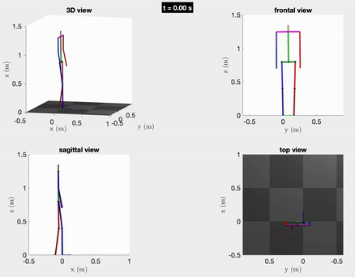
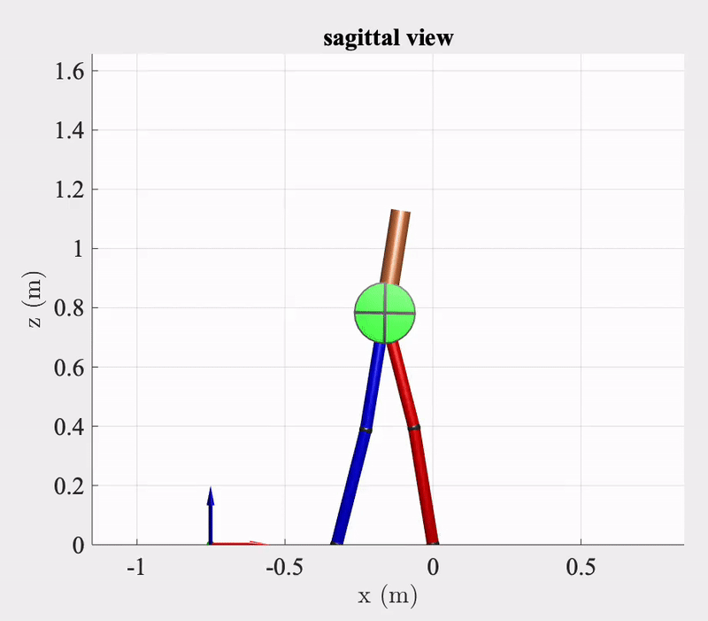

 

## Citation

To cite TROPIC, we suggest the following citation:

[[Link]](https://github.com/fevrem/TROPIC/blob/master/MF_PMW_JPS_IROS2020_TROPIC.pdf) M. Fevre, P. M. Wensing, and J. P. Schmiedeler, "Rapid Bipedal Gait Optimization in CasADi", in Proc. IEEE/RSJ International Conference on Intelligent Robots and Systems (IROS), 2020, pp. 3672-3678.

## Get Started

Follow these steps to run the 12-DOF spatial biped example:

- Run `TROPIC_add_path()` from the Matlab command line in the main TROPIC directory. 
- Go to `examples/spatial-12-dof-biped/` and open `main.m`
- Run `main.m` (this will overwrite the seed file with the newly optimized gait), or run each section and stop after the animation.

## TODO

- [x] Add 20-DOF spatial biped robot 

    Gait optimization on full-order dynamics: 
      
    

- [x] Add reaction wheel system (RWS) or *flywheel* to planar five-link biped model

    

- [ ] Add flat feet
- [ ] Add "get started" explanations